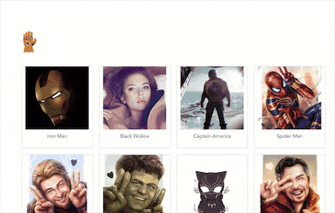

# vue-thanos-snap
灭霸打响指的消失效果。效果来源于 Google 搜索“灭霸” 或者 “thanos”, 同时部分资源也是来源于 Google 中直接扣下来的。
另外，其实代码是参考 https://github.com/lichking24/Thanos_Dust 的。 Thanos_Dust 代码已经算比较完善的了，我用 vue 来写了一下，加了一些英雄，修复了一些 bug ，加了一些效果之类的。

## effect demo
[demos](https://yiliang114.github.io/vue-thanos-snap/index.html)



- 点击一下手套，伴随音效和响指的动画，会有一半的英雄消失。
- 消失之后，再点一下，消失的英雄又会回来。

## details
- 随机选取一半的英雄，是通过下面的算法进行选取的：
  ```
  arr.sort(function() {
    return 0.5 - Math.random();
  });
  ```
- 被选中的英雄灰飞烟灭的效果解释：
  1. 使用 [html2canvas](http://html2canvas.hertzen.com/) 库将每一个英雄所在的 `dom` 节点渲染为一个 `canvas` 节点
  2. 通过 [generateFrames](https://github.com/yiliang114/vue-thanos-snap/blob/master/src/components/Main.vue/#L117) 方法，将整块的 `canvas` 画布图像按像素分割成许多块
  3. 创建一个跟选中的英雄所在的 `dom` 节点同一个位置、同样的大小的容器覆盖原 `dom` 节点
  4. 把第二步创建的块绘制到新的画布上，并都通过 `appendChild` 方法添加到第三步创建的父容器中
  5. 随机设置每一块的 `rotate` 角度和 `translate` 像素，就能完成灰飞烟灭的效果
  6. 将被覆盖的英雄的 `dom` 节点设置为不可见的，就完成了响指操作。

- 翻转时间，英雄又回来的效果是将原来的 `dom` 节点设置为可见的，并加了回复动画。（ `google` 的原版恢复动画是将 `color` 设置为 `green` ，因为这里没什么文字效果并不明显，就设置成了 `background-color` ）

## TODO
1. 因为之前几乎没有接触过 canvas ， 我理解用完全使用 vue 来写的话，应该是直接通过 data 驱动，现在的代码还有大量直接操作 dom
2. 锚点滑动似乎不够平滑
3. 偶尔音频与动画会有不同步（F5 之后， 貌似会恢复正常）